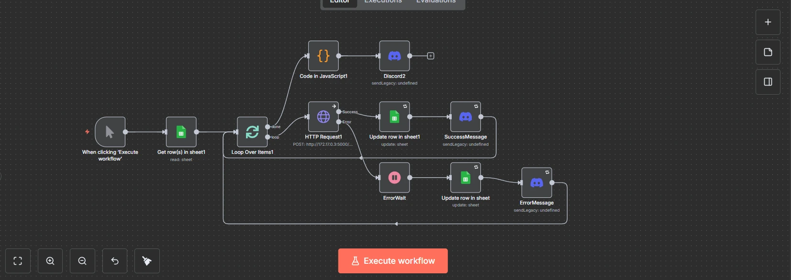

## Overview

Created an N8n workflow to automate RESTful API interactions, streamlining data processing and integration tasks. This project demonstrates how to leverage N8n's capabilities to connect various APIs, automate data flows, and enhance productivity.

## Workflow Highlights

- **API Integration**: Connected multiple RESTful APIs to fetch, process, and store data efficiently.
- **Google Sheets Integration**: Automated data entry and updates in Google Sheets, reducing manual effort and minimizing errors.
- **Discord Integration**: Automated Successfull and Error notification by broadcasting it in Discord Channels, reducing the time needed to react on issues encountered during workflow.
