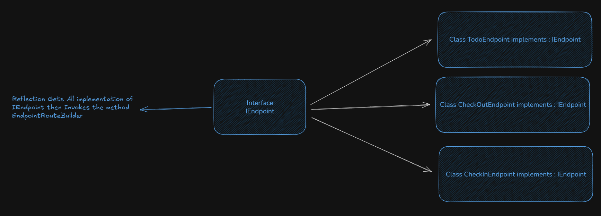

There are some other ways to discover your endpoints in Minimal API, and using third party is not one of them.

Using the built in Reflection Pattern we can instead create an extenstion host method in discovering the API Endpoints in the assembly we are working on.

On this method it finds the implementation for your endpoints using an interface. In this way we can mark the classes that are implementing a contract for Mapping and Endpoint.



Sample Code on IEndpoint Discovery:

```cs

using System.Reflection;

namespace ims.web.api.hosts;

public static class EndpointDiscovery
{
    private static Type _endpointType = typeof(IEndpoint);
    
    
    public static void RegisterEndpoints(this IEndpointRouteBuilder routeBuilder, IServiceProvider serviceProvider, params Assembly[] assembly)     
    {
        // Reflection Pattern to find all types that implement IEndpoint

        foreach (var ass in assembly)
        {
            Type[] types = GetAssemblyTypes(ass);
            foreach (Type type in types)
            {
                MethodInfo method = GetMethodInfo(type);
                var instance = ActivatorUtilities.CreateInstance(serviceProvider, type);
                var parameters = new object[] { routeBuilder };
                method.Invoke(instance, parameters);
            }
        }

      
    }

    private static MethodInfo GetMethodInfo(Type endpointType) 
        => endpointType
            .GetMethod(nameof(IEndpoint.MapEndpoints), BindingFlags.Public | BindingFlags.Static)
        ?? throw new InvalidOperationException($"The endpoint type does not implement the required MapEndpoints method. {endpointType.Name}");
    
    private static Type[] GetAssemblyTypes(Assembly assembly) 
        => assembly
            .GetTypes()
            .Where(t => _endpointType.IsAssignableFrom(t) && t is { IsAbstract: false, IsInterface: false})
            .ToArray() ?? throw new InvalidOperationException("No endpoint types found in the provided; assembly.");
}

```

lets understand each part, before we mix all the methods.

First what does this method actually do?

```cs
    Type[] GetType(Assembly assembly) 
```

injecting the assembly or assemblies your codebase is running. this method will discover all implementations that are **Classes** but *is not* **Abstract** and it implements the type of ***"IEndpoint"*** interface.

Then the method will return a multiple types of class endpoints that has implemented the interface.

Second.

```cs
    MethodInfo GetMethodInfo(Type endpointType) 
```

this method extracts uses the ``GetMethod()`` *function* in order to extract the following function we abstracted in IEndpoint interface which are:

```cs
    public interface IEndpoint
    {
        public abstract static void MapEndpoints(IEndpointRouteBuilder endpoints);
    }
```

Once we have established this and try to consume this on our implementation it would look like something like this: ⬇️

```cs
    public class AddingTagsEndpoint : IEndpoint
    {
        public static void MapEndpoints(IEndpointRouteBuilder endpoints)
        {
            throw new NotImplementedException();
        }
    }
```

Now you can mix em all together like this in one method:

```cs
public static void RegisterEndpoints(this IEndpointRouteBuilder routeBuilder, IServiceProvider.serviceProvider, params Assembly[] assembly)     
    {
        // Reflection Pattern to find all types that implement IEndpoint

        foreach (var ass in assembly)
        {
            Type[] types = ass.GetTypes();
            foreach (Type type in types)
            {
                MethodInfo method = GetMethodInfo(type);
                var instance = ActivatorUtilities.CreateInstance(serviceProvider, )
                var parameters = new object[] { routeBuilder };
            }
        }

      
    }
```

Using this for *IEndpointRouteBuilder* and adding the builder serviceprovider and Assemblies.
in each assembly get all the classes that implements IEndpoint then invoke the method of "MapEndpoint" in order to discover your ENDPOINT 😉😏 .

Thats IT!

Credits to:

Header Photo by [Juan Davila](https://unsplash.com/@juanster?utm_content=creditCopyText&utm_medium=referral&utm_source=unsplash) on [Unsplash](https://unsplash.com/photos/lake-under-blue-sky-during-daytime-P8PlK2nGwqA?utm_content=creditCopyText&utm_medium=referral&utm_source=unsplash")
